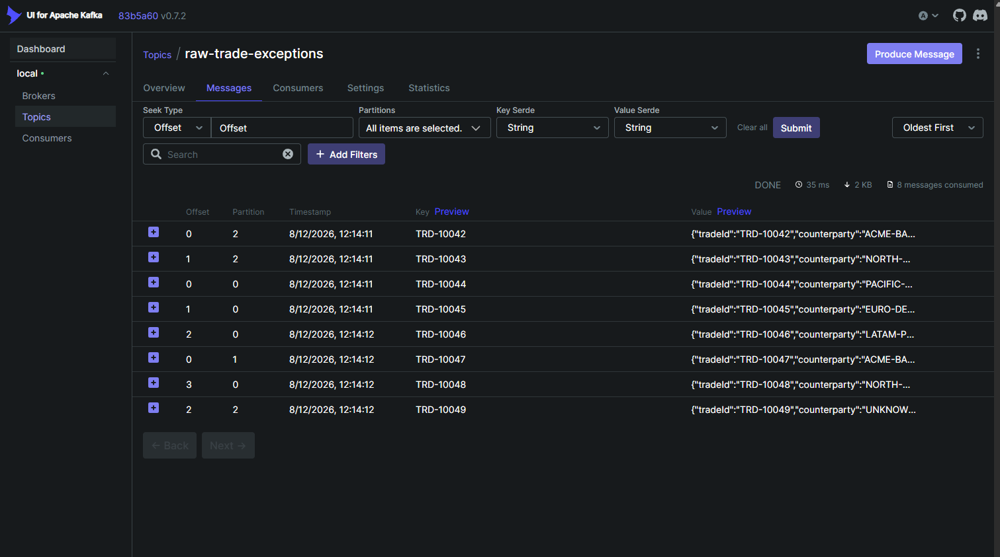
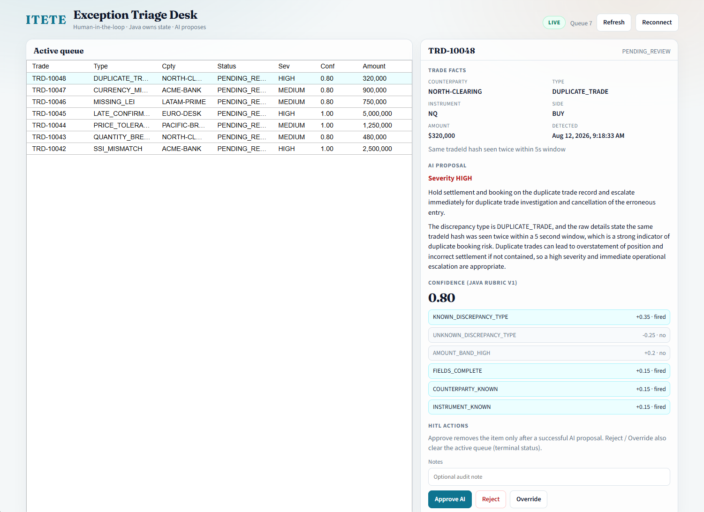
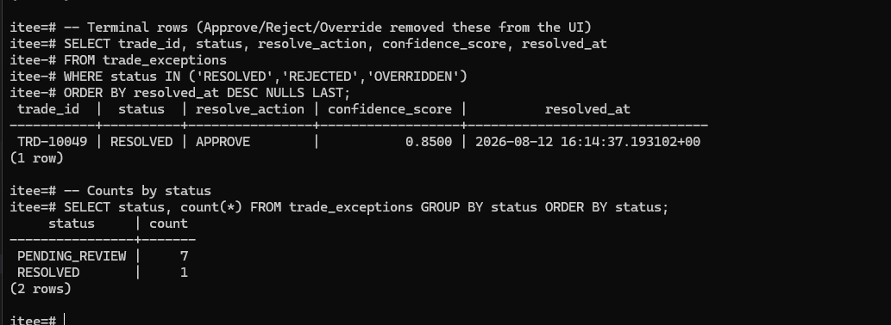

# ITETE — Guided Tour

> Self-guided. This document walks through exception ingest, AI proposal, Java confidence scoring, and human disposition.  
> Run the stack locally on **Windows** and follow along — see [README.md](README.md) for startup (Azure OpenAI required; no stub). Screenshots below match a clean `-FreshDb` run.  
> POC limits: [docs/known-gaps.md](docs/known-gaps.md).

```powershell
.\infra\deploy.ps1                 # once per environment — writes .env
.\scripts\start-stack.ps1 -FreshDb # Docker + AI + orchestrator + UI + sample feed
```

Wait until the console prints **Stack is up.** Open:

| Surface | URL |
|---|---|
| HITL desk | http://localhost:4200 |
| Kafka UI | http://localhost:8080 |
| Orchestrator health | http://localhost:8081/api/health |

Stop when done: `.\scripts\stop-stack.ps1`

---

## What this tool demonstrates

Middle-office exception handling has two halves that must stay separate. The qualitative half — *how severe is this break*, *what should ops do next* — is judgment under incomplete text. The quantitative / control half — *lifecycle state*, *who owns the ledger*, *how confident are we in a score we can defend* — is deterministic and must not come from the model grading its own homework.

This tool enforces that boundary architecturally:

- **Java (Spring)** is the system of record. It consumes Kafka, persists exceptions, scores confidence with a versioned rubric, and exposes REST + SSE.
- **Python (FastAPI + LangGraph + Azure OpenAI)** returns severity, recommendation, and reasoning only — never amounts, status transitions, or confidence.
- **Angular** is the human-in-the-loop desk. Nothing becomes terminal until an operator Approves, Rejects, or Overrides.

AI is called **after** the Kafka consume transaction commits. A slow or failing Azure call cannot block the consumer or poison offsets.

---

## 1. The Exception Triage Desk


After `start-stack -FreshDb`, the desk opens with a live queue of eight synthetic breaks (`TRD-10042` … `TRD-10049`). The green **LIVE** badge means the Angular app is connected to orchestrator SSE on `:8081`. **Queue 8** is the count of active (non-terminal) exceptions.

Select any row. The detail pane shows four layers in one place:

1. **Trade facts** — counterparty, type, instrument, side, amount, detected time, raw details (system of record)
2. **AI proposal** — severity plus recommendation / reasoning from Azure OpenAI
3. **Confidence (Java rubric v1)** — numeric score and which factors fired
4. **HITL actions** — Approve AI, Reject, Override

The header line states the contract: *Human-in-the-loop · Java owns state · AI proposes.*

---

## 2. Kafka Ingest — Before AI



Open Kafka UI → Topics → `raw-trade-exceptions` → Messages. You should see eight string messages keyed by `tradeId`, matching `sample-data/exceptions.json`.

What happened behind the scenes:

1. The Java producer published the fixture file to Kafka
2. Spring consumed each message, mapped it to a `TradeException`, persisted `NEW`, then **committed and acked**
3. Only after commit did an async worker call the AI engine
4. On success, Java ran the confidence scorer and moved the row to `PENDING_REVIEW`
5. SSE pushed updates to the desk

There is no HTTP to Azure inside the Kafka consumer transaction. If AI is down, rows still land in Postgres; analysis can recover on restart.

To replay another wave without wiping the database:

```powershell
.\scripts\services\start-producer.ps1 exceptions.json 2500
```

(`2500` is milliseconds between messages — slower is easier to watch as statuses move `NEW` → `ANALYZING` → `PENDING_REVIEW`.)

---

## 3. AI Proposal vs Java Confidence

Stay on a `PENDING_REVIEW` row in the desk (screenshot in §1 shows `TRD-10049` / `UNKNOWN_COUNTERPARTY`).

**AI proposal** is qualitative. The model suggests severity (HIGH / MEDIUM / LOW) and writes an ops-oriented recommendation. It does not invent trade amounts and it does not emit a confidence field — the API contract forbids it.

**Confidence** is computed only in Java (`ConfidenceScorer`, rubric `v1`). Factors are additive and documented in [docs/confidence-rubric-v1.md](docs/confidence-rubric-v1.md). In the example row:

| Factor | Weight | Fired |
|---|---:|---|
| `KNOWN_DISCREPANCY_TYPE` | +0.35 | yes |
| `AMOUNT_BAND_HIGH` | +0.20 | yes (≥ 1M) |
| `FIELDS_COMPLETE` | +0.15 | yes |
| `INSTRUMENT_KNOWN` | +0.15 | yes |
| `COUNTERPARTY_KNOWN` | +0.15 | no (`UNKNOWN-DESK-99`) |
| `UNKNOWN_DISCREPANCY_TYPE` | −0.25 | no |

Score **0.85** = 0.35 + 0.20 + 0.15 + 0.15. Same inputs + same rubric version → same score. That is the audit property LLM self-grading cannot provide.

---

## 4. Approving an Exception

On a ready row, optionally add an audit note, then click **Approve AI**.

Approve is allowed only when status is `PENDING_REVIEW` and an AI recommendation is present. The orchestrator sets terminal status `RESOLVED`, records `resolve_action = APPROVE`, and the desk drops the row from the active queue (SSE + filter).



Queue moves from 8 → 7. The next pending exception is selected automatically.

---

## 5. Prove It in Postgres

Java owns the ledger. Confirm the disposition in the database:

```powershell
docker exec -it itee-postgres psql -U itee -d itee
```

```sql
SELECT trade_id, status, resolve_action, confidence_score, resolved_at
FROM trade_exceptions
WHERE status IN ('RESOLVED', 'REJECTED', 'OVERRIDDEN')
ORDER BY resolved_at DESC NULLS LAST;

SELECT status, count(*) FROM trade_exceptions GROUP BY status ORDER BY status;
```



You should see `TRD-10049` as `RESOLVED` / `APPROVE` with the same confidence score the desk showed, and seven rows still in `PENDING_REVIEW`.

---

## 6. Reject and Override

Pick another pending row.

- **Reject** — terminal `REJECTED`. Use when the AI suggestion is wrong or the break should not be cleared that way. Works even if analysis failed (`ANALYZING_FAILED`).
- **Override** — enter a manual recommendation, then submit. Terminal `OVERRIDDEN`. Same rule: allowed on failed AI so ops are never blocked behind the model.

Approve is the only action that requires a successful AI proposal. That asymmetry is intentional.

---

## 7. Failure and Recovery (what the architecture does)

You do not need to break the stack to understand the control points:

- Concurrent AI calls are capped (bounded thread pool) so a stampede cannot melt Azure
- Analysis runs outside any DB transaction over HTTP/1.1
- On failure, status becomes `ANALYZING_FAILED`; Reject / Override remain available
- On orchestrator restart, rows stuck in `NEW` / `ANALYZING` / `ANALYZING_FAILED` are re-queued

Design decisions: [docs/architecture.md](docs/architecture.md). Payloads: [docs/contracts.md](docs/contracts.md).

---

## Suggested walkthrough

Start with `-FreshDb`, open the desk, select `TRD-10049` (or any HIGH / incomplete counterparty row), read the AI proposal and factor chips, Approve one exception, then confirm in Postgres.

Worth noticing along the way:

- The desk shows facts, AI text, and Java confidence in one view — three different owners, one screen
- Kafka messages exist before AI finishes; ingest does not wait on the LLM
- Confidence factors are explicit and recomputable; the model never supplies the score
- Approve / Reject / Override leave an auditable terminal row in Postgres

**What this tool is not (yet):**

- It does not connect to a live OMS, affirmations platform, or settlement system — dispositions are persisted locally
- Sample exceptions are synthetic fixtures, not a production feed
- Optional `resolved-trades` Kafka publish on terminal status is scoped as backlog
- The desk is a single-operator POC — no auth, no multi-user locking
- Stack automation is Windows PowerShell–oriented; see [docs/known-gaps.md](docs/known-gaps.md) for the full list
