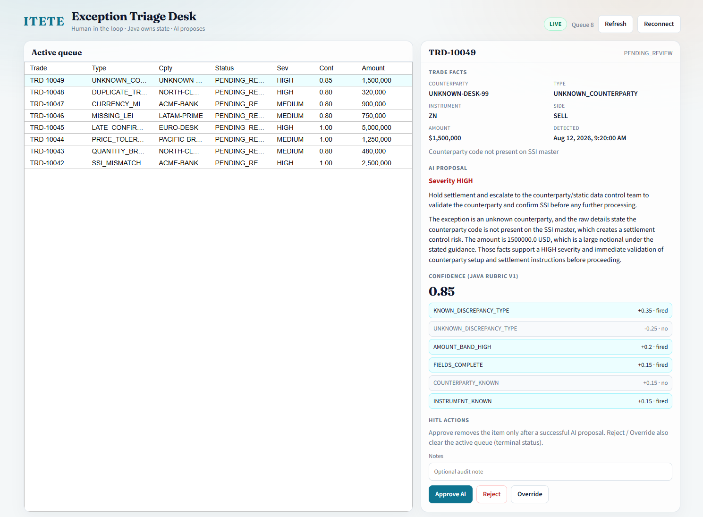

# Intelligent Trade Exception Triage Engine (ITETE)

Reference architecture for **human-in-the-loop middle-office exception triage**:

- **Java (Spring)** owns facts, lifecycle state, and **auditable confidence**
- **Python (FastAPI + LangGraph + Azure OpenAI)** proposes severity + recommendation text only
- **Angular** desk reviews via REST + SSE — Approve / Reject / Override

Confidence is an enterprise control concern: the LLM never self-grades. Java applies a versioned rubric ([docs/confidence-rubric-v1.md](./docs/confidence-rubric-v1.md)) that is recomputable from persisted fields (covered by JUnit).

See [DEMO.md](./DEMO.md) for a self-guided tour (with screenshots), [docs/architecture.md](./docs/architecture.md) for design decisions, and [docs/known-gaps.md](./docs/known-gaps.md) for honest POC limits.



## Why this pattern

| Concern | Owner | Why |
|---|---|---|
| Persist + ack Kafka | Java | System of record; AI outages must not poison the consumer tx |
| Severity / narrative | Azure OpenAI via Python | Qualitative proposal |
| Confidence score + factors | Java rubric | Audit, replay, model-swap without rescoring fiction |
| Disposition | Human (Angular HITL) | Terminal statuses only after operator action |

**Use this pattern when** you need AI assistance on operational exceptions without letting the model become the ledger or the risk grade.

## Prerequisites

This stack is a **local Windows demo**. Scripts are PowerShell and assume Docker Desktop on Windows.

| Requirement | Notes |
|---|---|
| **Windows 10/11** + PowerShell 7+ (`pwsh`) or Windows PowerShell 5.1 | `start-stack` / `stop-stack` are not macOS/Linux scripts |
| **Docker Desktop** | Kafka, Zookeeper, Kafka UI, Postgres |
| **Java 22** | Uses repo **Gradle wrapper** (`gradlew.bat`) — no global Gradle install required |
| **Python 3.11+** | `ai-engine/` (venv created on first start) |
| **Node 20+** + npm | `ui/` (`npm install` on first UI start) |
| **Azure CLI** + subscription | `.\infra\deploy.ps1` — **required**; there is **no AI stub** |

## Ports

| Service | Port |
|---|---|
| Kafka | `9092` |
| Kafka UI | `8080` |
| PostgreSQL | `5433` (host) → `5432` in container |
| Spring orchestrator | `8081` |
| FastAPI AI engine | `8000` |
| Angular desk | `4200` |

> Host DB port is **5433** so a local Windows PostgreSQL on 5432 does not steal connections.

## Quick start (cold demo)

```powershell
# 1) Once per Azure environment — writes gitignored repo-root .env (secrets not printed)
.\infra\deploy.ps1

# 2) Full local stack: Docker + AI + orchestrator + UI + sample feed
.\scripts\start-stack.ps1 -FreshDb

# 3) Desk
# http://localhost:4200  → follow DEMO.md
```

Tear down:

```powershell
.\scripts\stop-stack.ps1
.\infra\cleanup.ps1 -Environment dev   # Azure resources when finished
```

Useful flags:

```powershell
.\scripts\start-stack.ps1 -SkipUi
.\scripts\start-stack.ps1 -SkipProducer
.\scripts\stop-stack.ps1 -KeepInfra
.\scripts\stop-stack.ps1 -WipeVolume
```

### Individual services / smokes

```powershell
.\scripts\services\start-kafka.ps1
.\scripts\services\start-ai-engine.ps1
.\scripts\services\start-orchestrator.ps1
.\scripts\services\start-producer.ps1
.\scripts\services\start-ui.ps1

.\scripts\smoke\smoke-ai-engine.ps1
.\scripts\smoke\smoke-phase3.ps1
```

Orchestrator and producer invoke `.\gradlew.bat` (wrapper). First UI start runs `npm install` if `ui/node_modules` is missing.

## Layout

```
infra/                 Azure Bicep (OpenAI + Key Vault) + deploy/cleanup
producer/              Java Kafka mock feed
orchestrator/          Spring Boot: ingest, async AI client, confidence, REST, SSE
ai-engine/             FastAPI + LangGraph (qualitative only)
ui/                    Angular 19 HITL desk
sample-data/           Synthetic exception fixtures
docs/                  Contracts, rubric, architecture, known gaps
scripts/
  start-stack.ps1      Preferred entry
  stop-stack.ps1
  lib/                 Shared PowerShell helpers
  services/            Per-process start/stop
  smoke/               API smoke checks
DEMO.md                Guided tour
```

## Docs map

| Doc | Role |
|---|---|
| [DEMO.md](./DEMO.md) | Self-guided walkthrough + screenshots |
| [docs/architecture.md](./docs/architecture.md) | Design decisions / boundaries |
| [docs/contracts.md](./docs/contracts.md) | Kafka + REST + AI payloads |
| [docs/confidence-rubric-v1.md](./docs/confidence-rubric-v1.md) | Factor weights |
| [docs/known-gaps.md](./docs/known-gaps.md) | POC scope and known limits |
| [plan.md](./plan.md) | Phased build checklist |

## Environment

Never commit `.env`. Start from [`.env.example`](./.env.example) or `.\infra\deploy.ps1`. The AI engine and orchestrator **fail fast** if Azure OpenAI / `AI_ENGINE_API_KEY` are missing.

## Tests (thesis lock)

```powershell
.\gradlew.bat :orchestrator:test
```

Focus: `TradeExceptionMapper` (facts → `NEW`) and `ConfidenceScorer` (rubric math, including demo 0.80 / 0.85 cases).
