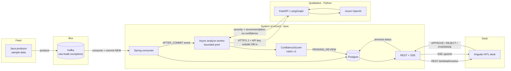

# ITETE — Architecture & Design Decisions

> **Status:** POC complete (Pre-0 through Phase 5). See [README.md](../README.md) for cold start and [DEMO.md](../DEMO.md) for the walkthrough.  
> **Design philosophy:** Complexity at the seams is intentional. The architecture keeps a hard boundary between probabilistic AI (severity / recommendation text) and deterministic Java (lifecycle state + auditable confidence), with a human as the only path to a terminal disposition.  
> **Note:** Design decisions for the shipped system — not a phase tracker. Build history lives in [plan.md](../plan.md).

---

## 1. Project context & business goal

**Goal:** A proof of concept for middle-office trade exception triage: ingest breaks from a message bus, propose a qualitative disposition with Azure OpenAI, score confidence with a versioned Java rubric, and require a human to Approve, Reject, or Override before anything is terminal.

**Value proposition:** LLMs hallucinate and self-grade poorly. In exception ops, the model must never invent amounts, own lifecycle status, or emit a confidence number that cannot be recomputed from persisted inputs. This system constrains AI to qualitative proposal text and keeps the ledger + score in deterministic Java, with HITL as the final gate.

**HITL design choice:** Async analyst review — the pipeline finishes a suggestion (`PENDING_REVIEW`), then the desk reviews a completed artifact over REST + SSE. This is not a mid-graph LangGraph `interrupt()` pause. Ops review a persisted exception row, not a live suspended graph.

---

## 2. System architecture & stack

| Layer | Technology | Purpose |
|---|---|---|
| **Feed** | Java `:producer` | Replays `sample-data/` into Kafka |
| **Message bus** | Kafka (Docker Compose) | Topic `raw-trade-exceptions` |
| **System of record** | Spring Boot 3 (`:orchestrator`), Java 22 | Consume, persist, async AI client, confidence scorer, REST + SSE |
| **Database** | PostgreSQL (host port **5433**) | Exception rows, AI fields, confidence factors, resolve audit |
| **AI engine** | FastAPI, LangGraph, Azure OpenAI | `POST /api/v1/analyze-exception` — severity + recommendation + reasoning only |
| **HITL desk** | Angular 19, AG Grid | Active queue, detail pane, Approve / Reject / Override |
| **Cloud AI infra** | Azure Bicep + `infra/deploy.ps1` | OpenAI + Key Vault; writes repo-root `.env` (required; no stub path) |

---

## 3. Runtime flow



**Step list:**

1. Producer publishes synthetic exception JSON to `raw-trade-exceptions`.
2. Spring consumer maps → persists `NEW` → **commits** → **acks** Kafka (no AI HTTP in this transaction).
3. `TransactionalEventListener(AFTER_COMMIT)` + `@Async` worker marks `ANALYZING`, calls FastAPI over HTTP/1.1 outside any DB transaction.
4. On success: persist severity / recommendation / reasoning, run Java `ConfidenceScorer`, set `PENDING_REVIEW`, emit SSE.
5. On failure: `ANALYZING_FAILED` in its own short transaction; Reject / Override remain available.
6. Desk loads via REST; live updates via SSE; operator resolves via `POST /api/exceptions/{id}/resolve`.

---

## 4. The HITL contract

This is the product control surface.

| Action | Allowed when | Terminal status |
|---|---|---|
| **Approve AI** | `PENDING_REVIEW` **and** AI recommendation present | `RESOLVED` |
| **Reject** | `PENDING_REVIEW` or `ANALYZING_FAILED` | `REJECTED` |
| **Override** | Same as Reject; requires manual recommendation text | `OVERRIDDEN` |

- The active queue shows only non-terminal statuses (`NEW`, `ANALYZING`, `PENDING_REVIEW`, `ANALYZING_FAILED`).
- SSE (`GET /api/stream`) upserts rows on ingest, analysis complete, and resolve — the desk is not poll-only.
- Approve is intentionally stricter than Reject/Override so ops are never blocked when AI fails, but cannot "Approve" empty analysis.

**Status path:**

```text
NEW → ANALYZING → PENDING_REVIEW → RESOLVED | REJECTED | OVERRIDDEN
                 ↘ ANALYZING_FAILED ↗ (Reject/Override still allowed)
```

Startup recovery re-queues `NEW` / `ANALYZING` / `ANALYZING_FAILED` so demos and restarts do not leave orphaned work.

---

## 5. Confidence boundary (non-negotiable)

**Problem:** Asking the LLM for a 0–100 confidence score is convenient and indefensible — the model grades its own homework and the number is not recomputable from controls data.

**Rules:**

1. **Derived, not confessed** — score comes from explicit signals (taxonomy, amount bands, completeness, allow-lists).
2. **Owned by `:orchestrator` (Java only)** — rubric version + factor breakdown persist on the exception row.
3. **Python must not return confidence** — analyze API is severity + recommendation + reasoning only ([contracts.md](./contracts.md)).
4. **UI shows the why** — desk renders score and fired factors from [confidence-rubric-v1.md](./confidence-rubric-v1.md).

Same inputs + same rubric version → same score.

---

## 6. Ingest vs AI transaction boundary

**Anti-pattern:** Kafka listener holds a DB transaction open while calling Azure. Slow LLM → stalled consumer, timeout, redelivery risk.

**Required shape (shipped):**

- Persist `NEW` and ack without waiting on AI.
- Analyze on a **bounded** thread pool (cap concurrent Azure calls).
- Hold **no** DB transaction across the HTTP call.
- Use Java `HttpClient` **HTTP/1.1** to the AI engine (HTTP/2 to local uvicorn caused empty-body 422s in practice).

---

## 7. Success criteria for the POC

Complete when all of the following are true end-to-end:

1. Sample exceptions reach Kafka and land in Postgres as `NEW` without waiting on AI.
2. Async analysis produces severity + recommendation; confidence appears only from Java.
3. The Angular desk shows facts, AI proposal, and confidence factors on one screen (LIVE via SSE).
4. An operator can Approve, Reject, or Override; terminal status is visible in Postgres.
5. Cold start is one documented path: `.\infra\deploy.ps1` then `.\scripts\start-stack.ps1` ([DEMO.md](../DEMO.md)).

---

## 8. Related docs

| Doc | Role |
|---|---|
| [../README.md](../README.md) | Cold start, ports, layout |
| [../DEMO.md](../DEMO.md) | Self-guided tour + screenshots |
| [contracts.md](./contracts.md) | Kafka + REST + AI payloads |
| [confidence-rubric-v1.md](./confidence-rubric-v1.md) | Factor weights and allow-lists |
| [known-gaps.md](./known-gaps.md) | Honest POC limits |
| [../plan.md](../plan.md) | Phased build checklist |
